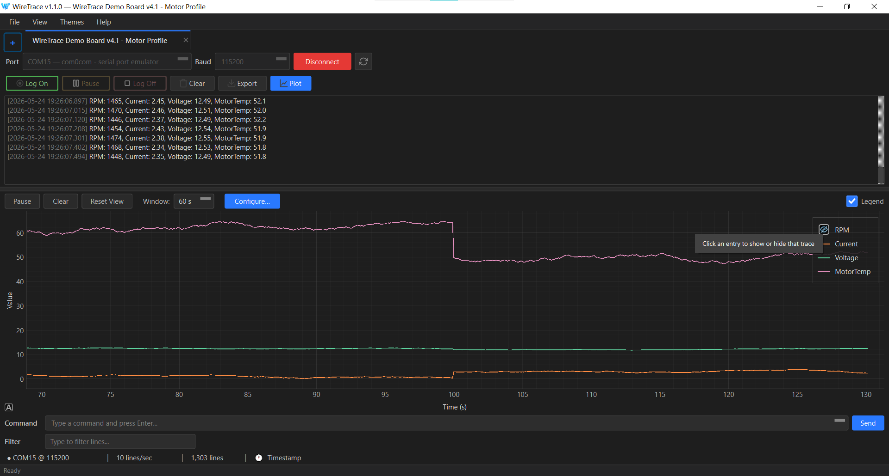
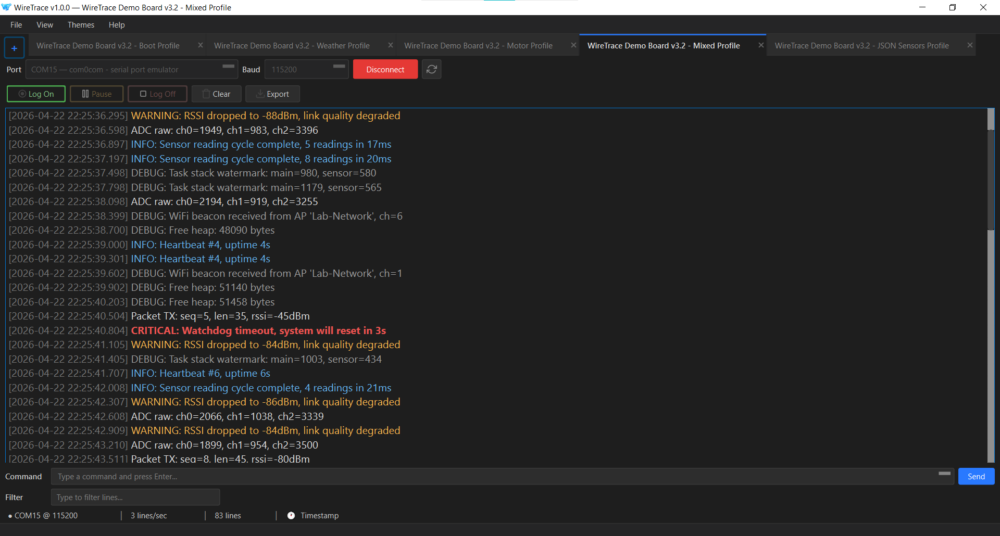
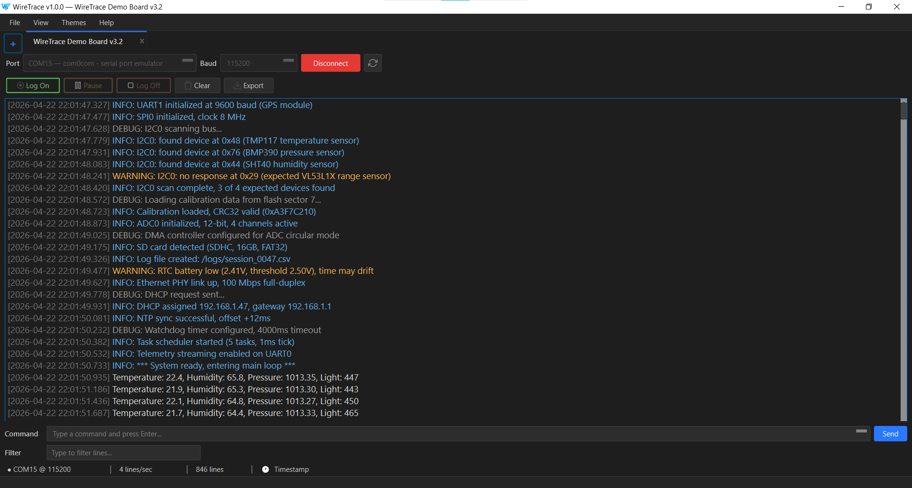
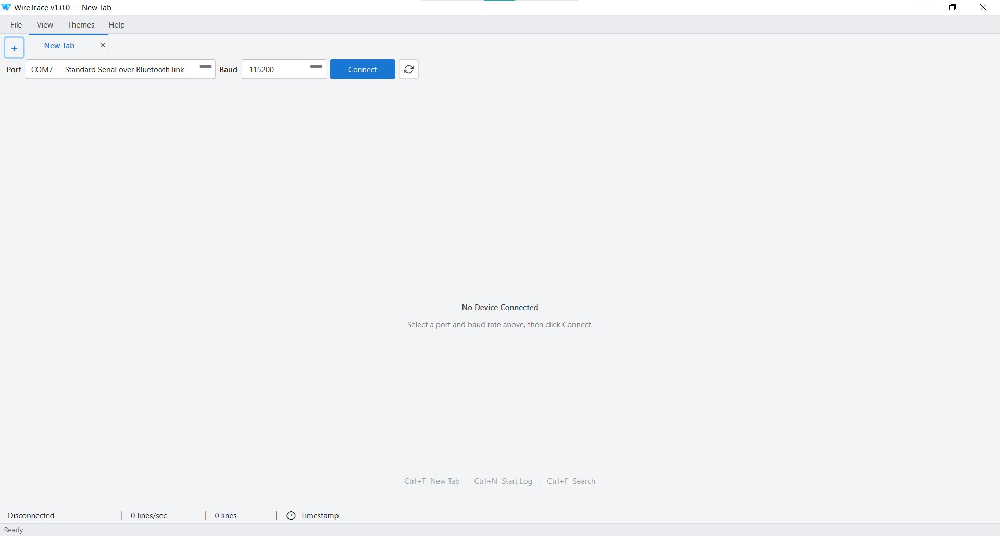
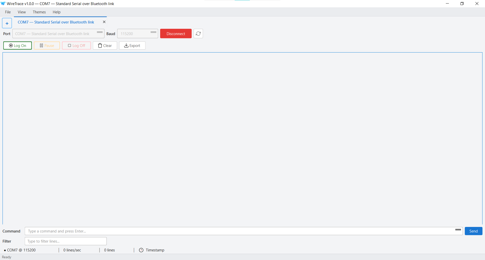
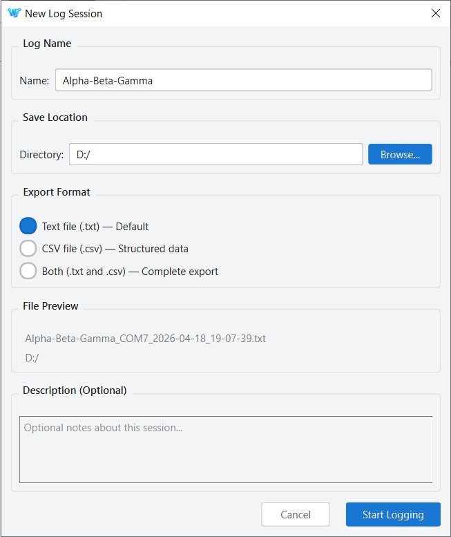
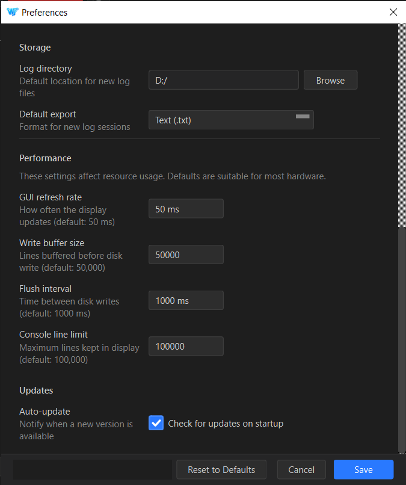
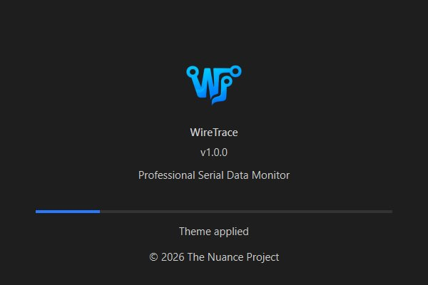

# WireTrace

A serial data monitor for hardware and embedded engineers.

WireTrace captures data from multiple serial devices simultaneously,
sustains throughput above ten thousand lines per second, and writes
every line to disk without interfering with the live view. Built for
hardware bring-up, long capture sessions, and the kind of debugging
where what you *don't* log is what you needed.

**[Download the latest release →](https://github.com/TheNuanceProject/WireTrace/releases/latest)**

Website: [thenuanceproject.com/projects/wiretrace](https://thenuanceproject.com/projects/wiretrace)

---







<details>
<summary>More screenshots</summary>

**Welcome screen — before connecting a device:**



**Connected to a device, light theme:**



**New log session — choose format, directory, and description:**



**Preferences — performance tuning and update settings:**



**Splash screen:**



</details>

---

## What it does

- **Multi-device tabs.** Each connected device runs in its own tab,
  isolated from the others. Switching between tabs does not interrupt
  data capture on any of them.
- **Buffered logging.** A separate thread writes to disk on a schedule.
  The read path is never blocked. The disk log captures every line
  received, regardless of what is shown in the live view.
- **Search and live filter.** Search captured data with forward and
  backward navigation. Filter the live view by substring without
  affecting what is written to disk.
- **Live data plotter.** Auto-detects numeric structure (JSON
  objects, `key: value` pairs, or positional delimited values) from
  the first fifty data lines and renders them as time-series traces
  in a docked panel below the console. When auto-detect is not
  enough, a Configure Plot dialog lets you declare a regex with
  named groups, save it as a profile, and set a per-tab default —
  for firmware that emits its own timestamped or log-prefixed
  format. Theme-aware, cross-platform colourblind-safe palette,
  per-trace toggle from the legend.
- **Structured CSV export.** Two modes. Auto-detect identifies common
  patterns (`key: value` pairs and JSON-shaped lines) and pivots them
  into named columns. Raw mode writes a two-column file with
  timestamps and lines.
- **Severity tagging.** Each line is automatically classified as one
  of CRITICAL, ERROR, WARNING, INFO, DEBUG, COMMAND, or DATA.
  Tags are color-coded in the console.
- **Command console.** Send commands back to the connected device,
  with a recallable command history.
- **Two themes.** Studio Light and Midnight Dark.
- **Auto-update.** Checks for new versions and updates in place.

## Platforms

WireTrace is designed to run on Windows, macOS, and Linux. The codebase
is cross-platform — it uses Qt (via PySide6) for the UI, QSerialPort
for serial I/O, and a build pipeline that produces native binaries for
all three operating systems.

**Pre-built binaries are published for Windows and Linux.** macOS is
supported from source. This reflects who maintains the project (a single
person) and which platforms are tested for each release, not a design
limitation of the software.

If you want WireTrace on macOS:

- **Build it from source** using the included build scripts — the
  BUILD_GUIDE covers all three platforms
- **Open an issue** to express interest — if there's demand, a pre-built
  macOS binary becomes a realistic priority
- **Submit a pull request** with test results on your platform —
  contributions that validate cross-platform behaviour are especially
  welcome

### System requirements (binary install)

- **Windows:** 64-bit Windows 10 or newer
- **Linux:** Ubuntu 20.04 or equivalent (x86-64); AppImage or `.deb`
- **macOS:** 11 (Big Sur) or newer, built from source
- Roughly 100 MB of disk space plus room for your logs

CPU-only software rendering — runs in remote desktop sessions,
virtual machines, and hardware without dedicated graphics.

## Install

### Windows (binary)

Download the installer from the
[Releases page](https://github.com/TheNuanceProject/WireTrace/releases/latest)
and run it. The application launches from the Start menu.

On first launch, the welcome screen prompts for a device connection.
Everything else appears once a device is connected.

### Linux (binary)

Download the `.AppImage` from the
[Releases page](https://github.com/TheNuanceProject/WireTrace/releases/latest),
make it executable (`chmod +x`), and run it — no installation needed. A
`.deb` is also provided for Debian/Ubuntu (`sudo dpkg -i`). In-app
auto-update applies to the AppImage (it replaces itself and relaunches);
`.deb` installs update via a fresh download.

### macOS

A pre-built macOS binary is not currently published; build from source
(see below). It takes a few minutes on modern hardware.

## Build from source

The build pipeline uses Nuitka (standalone mode) to compile Python to
a native binary, then platform-specific packaging tools to produce
a distributable (Inno Setup on Windows, create-dmg on macOS,
appimage-builder + dpkg-deb on Linux).

```bash
git clone https://github.com/TheNuanceProject/WireTrace.git
cd WireTrace

python -m venv .venv
.venv\Scripts\activate                 # Windows
# source .venv/bin/activate              # macOS / Linux

pip install -r requirements.txt
pip install -r requirements-build.txt
python main.py                          # run from source
```

To build a distributable installer locally:

The version is read from `version.py`; no version flag is needed.

```bash
# Windows
python build/build.py --platform windows

# macOS
python build/build.py --platform macos

# Linux
python build/build.py --platform linux
```

See [BUILD_GUIDE.md](./BUILD_GUIDE.md) for detailed prerequisites and
platform-specific notes.

## Contributing

WireTrace is maintained by a single person in spare hours.
Contributions are welcome — please read
[CONTRIBUTING.md](./CONTRIBUTING.md) first. It covers scope, response
expectations, and how to propose changes in a way that has a good
chance of being merged.

Contributions that validate or improve cross-platform behaviour
(macOS, Linux builds) are especially appreciated.

For security issues, please see [SECURITY.md](./SECURITY.md).

## License

[MIT](./LICENSE). Use it, fork it, ship it in your own products if
that helps. Attribution is appreciated but not required.

Third-party dependencies and their licenses are documented in
[NOTICE](./NOTICE).

## Trademarks and Other Uses of the Name

WireTrace, as used in this repository and at
[thenuanceproject.com](https://thenuanceproject.com), refers to this
open-source serial data monitor for hardware and embedded engineers.
It is an independent project by The Nuance Project and is not
affiliated with, sponsored by, or endorsed by any other product,
company, or organisation that may use a similar name in a different
product category. The Nuance Project does not claim a trademark on
the name.

---

Built under [The Nuance Project](https://thenuanceproject.com) by
Mohamad Shahin Ambalatha Kandy.